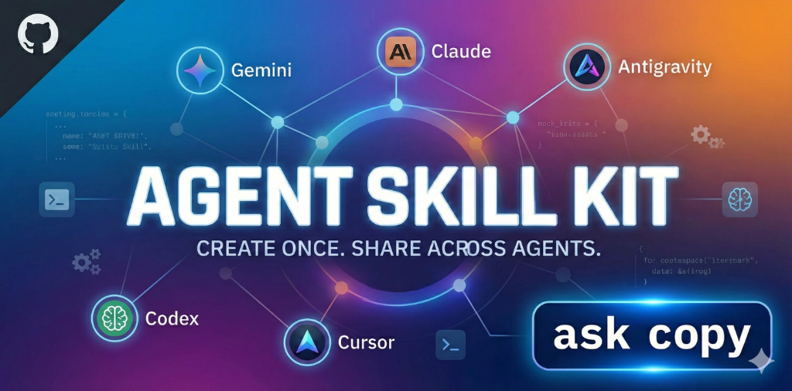

# Agent Skill Kit (ASK)



**Agent Skill Kit (ASK)** is a CLI toolkit for managing, distributing, and syncing skills across multiple AI agents. It serves as a unified "package manager" for your AI's capabilities, allowing you to define a skill once and deploy it to **Gemini, Claude, Codex, Antigravity, Cursor**, and more.

## 🧠 Why Agent Skill Kit?

Managing instructions for multiple AI agents is tedious. You often have to:
*   Copy `.cursorrules` to `.codex.md`.
*   Manually sync `~/instructions.md` with project-specific prompts.
*   Format skills differently for Gemini (`SKILL.md`) vs Claude (Slash Commands).

**ASK** solves this by treating skills as **reusable packages**.
1. **Define Once**: Write a skill in a standard format.
2. **Deploy Anywhere**: ASK transforms and copies the skill to the correct location and format for each agent.
3. **Sync**: Keep all your agents updated with a single command.

## 🚀 Features

- **Multi-Agent Support**: Native support for Gemini, Claude Code, OpenAI Codex, Antigravity, and Cursor.
- **Dynamic Discovery**: Automatically discovers available agents in the `agents/` directory.
- **Safe Copy**: Strictly adheres to "Do Not Overwrite". Prompts for a new name if a skill conflicts.
- **Local & Global**: Choose between **Project-Local** (specific to one repo) or **Global** (user-wide) deployment.
- **AI-Assisted Creation**: Includes meta-skills that teach your AI how to create new skills (`skill-creator`) or add new agents (`add-agent`).
- **Extensible**: Add support for any new AI agent in seconds via the `ask add-agent` wizard.

## 📦 Installation

```bash
# Clone the repository
git clone https://github.com/NavanithanS/Agent-Skill-Kit.git
cd Agent-Skill-Kit

# Install in editable mode
pip install -e .
```

## 🛠 Usage

### 1. Copy Skills to an Agent ⭐
**The primary way to use ASK** — Deploy skills to your AI agents using the interactive wizard.

**Interactive Mode** (Recommended):
```bash
ask copy
```
The wizard guides you through:
1. **Skill Selection**: Beautiful table showing all skills with descriptions and categories
2. **Agent Selection**: Compatible agents highlighted for your chosen skill
3. **Destination**: Choose between local (project) or global (user-wide) installation

**Quick Mode** (with flags):
```bash
# Copy specific skill
ask copy gemini --skill bug-finder

# Copy all compatible skills to an agent
ask copy claude --all
```

### 2. List Available Skills
View your library of skills, including descriptions and supported agents.
```bash
ask list
```

### 3. Create a New Skill
**AI-Assisted** (Recommended):
Simply ask your AI agent to create a skill for you:
```
Create a new skill for Docker best practices

Make a skill that teaches REST API design

create new skill: explaining-code
Purpose: Explains code using analogies, ASCII diagrams, and step-by-step walkthroughs. Triggered by queries like "How does this work?"
Instructions emphasize conversational tone, multiple analogies, and highlighting common misconceptions.
```
*Prerequisites: Deploy `ask-skill-creator` to your agent first (see [Tooling Skills](#tooling-skills-meta-skills)).*

**Manual CLI** (Alternative):
Launch the interactive wizard to generate a standardized skill template.
```bash
ask create skill
```

### 4. Sync All Skills
Synchronize your entire skill library to all supported agents at once.
```bash
ask sync all
```

### 5. Add Support for New Agents
Want to use **Windsurf** or **Aider**? Use the scaffold wizard:
```bash
ask add-agent
```
This creates the necessary adapter code, making the new agent available instantly.

## 🎯 Supported Agents

| Agent | Local Path (Project) | Global Path (User) | Format |
|-------|----------------------|--------------------|--------|
| **Antigravity** | `.agent/skills/` | `~/.gemini/antigravity/skills/` | SKILL.md (YAML) |
| **Gemini CLI** | `.gemini/skills/` | `~/.gemini/skills/` | SKILL.md (YAML) |
| **Claude Code** | `.claude/commands/` | `~/.claude/commands/` | Markdown Command |
| **Codex** | `codex.md` | `~/.codex/instructions/` | Markdown |
| **Cursor** | `.cursor/rules/` | `~/.cursor/rules/` | Markdown Rules |

## � Available Skills

ASK comes with a curated collection of skills to boost your AI agent's capabilities. Each skill provides specialized instructions and best practices.

### Planning Skills

| Skill | Description | Use Cases |
|-------|-------------|-----------|
| **[adr-logger](skills/planning/ask-adr-logger/README.md)** | Automates creation of Architectural Decision Records | • Recording tech decisions<br>• Documenting context & consequences<br>• Maintaining decision history |
| **[brainstorm](skills/planning/ask-brainstorm/README.md)** | Guidelines for exploring user intent and requirements | • Defining user intent<br>• Gathering requirements<br>• Exploring design options |
| **[project-memory](skills/planning/ask-project-memory/README.md)** | Maintains a 'Project Brain' of decisions | • Avoiding re-discussions<br>• Checking past decisions<br>• Recording new choices |

### Coding Skills

| Skill | Description | Use Cases |
|-------|-------------|-----------|
| **[bug-finder](skills/coding/ask-bug-finder/README.md)** | Best practices for systematic bug hunting and debugging | • Debugging complex issues<br>• Isolating bugs<br>• Using debugging tools |
| **[code-reviewer](skills/coding/ask-code-reviewer/README.md)** | AI code reviewer providing constructive feedback | • Code quality checks<br>• Security & performance review<br>• Learning best practices |
| **[commit-assistance](skills/coding/ask-commit-assistance/README.md)** | Assist with code review, staging, and committing | • Pre-commit review<br>• Meaningful commit messages<br>• Staging files |
| **[explaining-code](skills/coding/ask-explaining-code/README.md)** | Explains code using analogies and diagrams | • Understanding complex code<br>• Visualizing flow<br>• Learning new codebases |
| **[flutter-architect](skills/coding/ask-flutter-architect/README.md)** | Senior Flutter skill using FVM | • Layer-First Architecture<br>• Stream-based Services<br>• Strict coding conventions |
| **[flutter-mechanic](skills/coding/ask-flutter-mechanic/README.md)** | Maintenance skill for Flutter projects using FVM | • Clean Build Protocol<br>• iOS/Android fixes<br>• Release protocols |
| **[laravel-architect](skills/coding/ask-laravel-architect/README.md)** | Senior scaffolding skill for Laravel (SQL/Mongo) | • Logic Layer separation<br>• Hybrid SQL/Mongo Relations<br>• Test-Driven Scaffolding |
| **[laravel-mechanic](skills/coding/ask-laravel-mechanic/README.md)** | Senior maintenance skill for database safety | • Zero Data Loss protocol<br>• N+1 Query prevention<br>• Queue debugging & forensics |
| **[owasp-security-review](skills/coding/ask-owasp-security-review/README.md)** | Static code analysis aligned with OWASP Top 10 | • Security scanning<br>• Identifying vulnerabilities<br>• Compliance checks |
| **[python-refactor](skills/coding/ask-python-refactor/README.md)** | Guidelines for Python code refactoring | • Improving code quality<br>• Refactoring legacy code<br>• Python best practices |
| **[refactoring-readability](skills/coding/ask-refactoring-readability/README.md)** | Improves code structure for clarity | • Renaming vars/functions<br>• Reducing complexity<br>• Improving readability |
| **[unit-test-generation](skills/coding/ask-unit-test-generation/README.md)** | Automates creation of comprehensive unit tests | • Generating new tests<br>• Covering edge cases<br>• Improving coverage |
| **[vue-architect](skills/coding/ask-vue-architect/README.md)** | Expert scaffolding for Vue 3 (Inertia/Nuxt) | • Component blueprints<br>• Stack detection<br>• Best practices enforcement |
| **[vue-mechanic](skills/coding/ask-vue-mechanic/README.md)** | Expert maintenance skill for Vue 3 (Inertia) | • Fixing navigation reloads<br>• Debugging prop mismatches<br>• Solving reactivity issues |
| **[component-scaffolder](skills/coding/ask-component-scaffolder/README.md)** | Standardizes UI component creation | • Consistent folder structure<br>• Typed props<br>• Auto-generating tests |
| **[db-migration-assistant](skills/coding/ask-db-migration-assistant/README.md)** | Ensures safe database schema updates | • Drafting migrations<br>• Creating rollback scripts<br>• Preventing data loss |
| **[readme-gardener](skills/coding/ask-readme-gardener/README.md)** | Keeps documentation in sync with code | • Updating API docs<br>• Documenting new features<br>• Maintaining README accuracy |
| **[shadcn-architect](skills/coding/ask-shadcn-architect/README.md)** | Enforces shadcn/ui patterns and consistency | • Preventing style bloat<br>• Enforcing import rules<br>• Promoting accessibility |

---

### Tooling Skills (Meta-Skills)

#### 🛠️ ask-skill-creator
**Description**: Teaches AI agents how to create skills for Agent Skill Kit

**How to Use**:
```bash
# Deploy to all agents so they can create skills
ask sync all
```

**Use Cases**:
- **AI-Assisted Skill Creation**: Let your AI agent create new skills by simply asking
  ```
  "Create a skill for API design best practices"
  ```
- Standardizing skill structure and format
- Automating skill scaffolding
- Building your custom skill library
- Teaching AI agents the skill creation workflow

**Example Workflow**:
1. Deploy this skill to your agent: `ask copy gemini --skill ask-skill-creator`
2. Ask your agent: "Create a skill called 'ask-docker-best-practices' for containerization guidelines"
3. The agent generates the skill files automatically

---

#### 🎯 ask-add-agent
**Description**: How to add support for new AI code editors to Agent Skill Kit

**How to Use**:
```bash
# Deploy to help your agent add new editor support
ask copy antigravity --skill ask-add-agent
```

**Use Cases**:
- **Extending ASK**: Add support for new AI editors (Windsurf, Aider, etc.)
- Creating custom agent adapters
- Understanding the agent adapter architecture
- Contributing new agent support to the project

**Example Workflow**:
1. Deploy this skill to your agent
2. Run the wizard: `ask add-agent`
3. Or ask your agent to help: "Add support for Windsurf editor"
4. The agent follows the documented process to create the adapter

---

#### 📄 ask-pdf-processing
**Description**: Handle PDF text extraction, form filling, and merging

**How to Use**:
```bash
ask copy antigravity --skill ask-pdf-processing
```

**Use Cases**:
- Extracting text from PDF documents
- Processing PDF forms
- Merging multiple PDFs
- PDF automation workflows

---

#### 🧠 ask-skill-capture
**Description**: Meta-skill. Analyzes the current session's lessons and saves them as a permanent reusable skill.

**How to Use**:
```bash
# Deploy to your agent (e.g., Antigravity, Gemini)
ask copy antigravity --skill ask-skill-capture
```

**Use Cases**:
- **Chat-to-Code**: Turn "messy" chat context into a structured skill
- **Constraint Capture**: Permanently save rules like "Always use FVM" or "Don't use Tailwind"
- **Workflow Automation**: Save a successful debugging sequence as a reusable protocol
- **Team Scaling**: Share tacit knowledge with your team via git-committed skills

**Example Workflow**:
1. You struggle through a task and finally get it right
2. You say: "Capture this as a skill called 'ask-deployment-protocol'"
3. The agent analyzes the conversation and generates the `SKILL.md`
4. You verify and save it

---

### 🚀 Quick Start with Skills

```bash
# View all available skills
ask list

# Deploy a specific skill to an agent
ask copy gemini --skill ask-bug-finder

# Deploy all compatible skills to an agent
ask copy claude --all

# Sync all skills to all agents
ask sync all

# Create your own skill (interactive)
ask create skill

# Or ask your AI agent to create one (if skill-creator is deployed)
"Create a new skill for API testing best practices"
```

## �📐 Skill Format

Each skill is a directory containing:
*   **`skill.yaml`**: Metadata (name, description, tags, supported agents).
*   **`README.md`**: The actual prompt/instructions for the AI.

> [!IMPORTANT]
> **Naming Convention**: All skill names must start with the `ask-` prefix (e.g., `ask-bug-finder`, `ask-commit-assistance`).

```yaml
# skill.yaml
name: ask-bug-finder
version: 1.0.0
category: coding
agents:
  - gemini
  - claude
  - cursor
```

## 🧩 Design Principles

1.  **Universal Definition**: Skills are defined in a neutral format that can be adapted to any agent.
2.  **Local-First, Global-Ready**: Prioritize project-specific skills (checked into git) while supporting user-wide global skills.
3.  **Safe by Default**: The CLI will **never** silently overwrite an existing skill. It always asks.
4.  **Agentic Workflow**: The toolkit includes skills (`skill-creator`) specifically designed to help AI agents help *you* build more skills.

## 🗂 Repository Structure

```
agent-skill-kit/
├── ask/                     # CLI Source Code
│   ├── commands/            # logic for create, copy, sync, add-agent
│   └── utils/               # adapter logic, filesystem helpers
├── agents/                  # Adapters for each AI agent
│   ├── gemini/
│   ├── claude/
│   ├── codex/
│   ├── antigravity/
│   └── cursor/              # (Added via ask add-agent)
└── skills/                  # The Skill Library
    ├── coding/
    └── tooling/
```

## 🤝 Contributing

Contributions are welcome!
1.  **Create a Skill**: Use `ask create skill` and submit a PR with your best prompts.
2.  **Add an Agent**: Use `ask add-agent`, test it, and submit the new adapter.

## License

MIT
